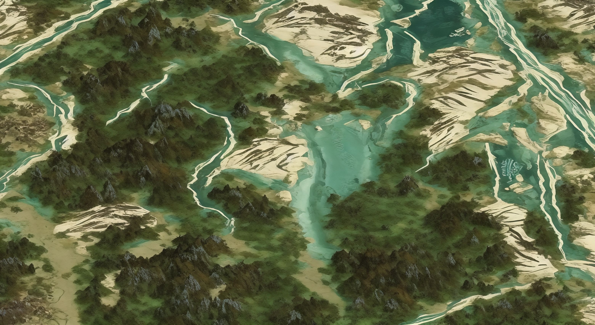

### Hi there 👋
💻 I’m currently working on Diffusion-based Image Editing.
 

<!--  
  -->
<figure class="half">
    
    
</figure>
<!--
**Sooplex/Sooplex** is a ✨ _special_ ✨ repository because its `README.md` (this file) appears on your GitHub profile.

- 🌱 I’m currently learning ...
- 👯 I’m looking to collaborate on ...
- 🤔 I’m looking for help with ...
- 💬 Ask me about ...
- 📫 How to reach me: ...
- 😄 Pronouns: ...
- ⚡ Fun fact: ...
-->
